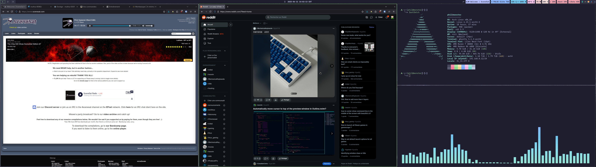

# DotFiles

This is a git repo for my dot files, maintained using GNU stow.

Clone this repo, cd into it, then do this to install everything:
```
stow */
```

Or, to install only one package:
```
stow packagename
```


## Niri Scrolling Window Manager



- Waybar
- Tray Icons:
    * blueman-tray
    * ckb-next
    * udiskie
    * arch-update
    * nm-applet
- Librewolf Web Browser
- fastfetch
- cava
  
