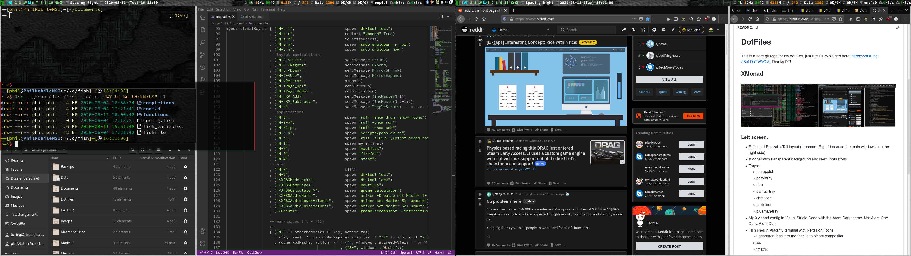

# DotFiles

This is a git repo for my dot files, maintained using GNU stow.

## XMonad

### Left screen:
  - Spacing Magnified Reflected ResizableTall layout (renamed "Right" because the main window is on the right side)
  - XMobar with transparent background and Nerd Fonts icons
  - Trayer:
    * nm-applet
    * pasystray
    * pamac-tray
    * cbatticon
    * redshift-gtk
    * blueman-tray
  - zsh shell in Alacritty terminal (transparent background thanks to picom compositor)
  - fish shell in Alacritty terminal (listing files using lsd with Nerd Font icons)
  - Nautilus File Manager
  - My XMonad config in Visual Studio Code with the Atom Dark theme. Not Atom One Dark, Atom Dark.
  
### Right screen:
  - Spacing Magnified ResizableTall layout (renamed left because the main window in on the left side)
  - Reddit in Firefox
  - This readme on GitHub in Firefox
